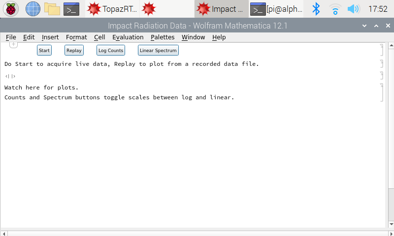
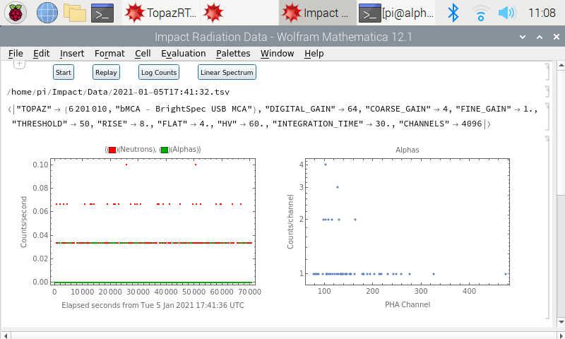

# ImpactRadiation
A Mathematica-based "app" to acquire and display alpha particle and neutron data for the Impact project.

As set up on the project's two Raspberry Pi computers, the "app", `TopazRT.nb`, launches automatically on startup. Booting and starting the application takes about 70 seconds. When it's ready, you should see this:

The "app" uses programs from [TopazTools](https://github.com/noqsi/TopazTools) to interact with the Topaz MCA. It records data in TSV files in `Impact/Data`. The data file names are ISO timestamps indicating the UTC time of acquisition.

The `Start` button starts acquisition, changing to a `Stop` button when acquisition is in progress. The `Stop` button stops acquisition. During acquisition, plots are refreshed every 30 second acquisition cycle.

The `Replay` button opens a file selector that you may use to choose a file to be plotted.

The other buttons allow the operator to toggle between linear and logarithmic scaling on the plots.

Here's the output of a test run collecting cosmic ray background.

## Parameters
The script `Impact/ImpactRadiation/topaz_setup` sets parameters for the data acquisition.

## Behind the curtain
If you close or miniaturize the acquisition window, you'll see the *Mathematica* notebook containing the code that does the work. This notebook is not write protected: if you are familiar with *Mathematica*, you may make changes.
## Quitting the app
Choose **File->Quit** from the menu bar. If it asks you if you want to save changes, you should probably choose `Don't Save` unless you made an intentional change to `TopazRT.nb`.
## Restarting the app
There's launcher installed on the desktop called "Impact Radiation Data" with a Raspberry Pi icon. It restarts the app. Or just reboot.
## Issues
*Mathematica* does not do a good job of recovering memory it is no longer using. Runs longer than 12 hours may have memory difficulties. Quitting and restarting the app clears the difficulty. The easiest way to do this is simply to reboot the Raspberry Pi.
